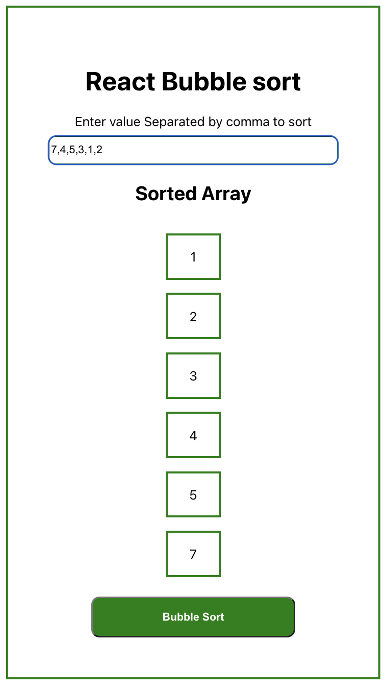

## bubble sort
    -   sorted by comparing the next value,then swap
     them incase the left is smaller than the right, 
    then next two values, every time the comparison 
    run from left to right doing the comaparison
    till there is one complete comparison run 
    wont have any swap then the program knows that 
    sorted is completed.

#### technology
    -   React
    -   html
    -   CSS

#### Screen Shot

#### Instruction

Enter list of array in the text box, each array should be separated by a comma, once done click the button '<i>Bubble Sort</i>' to sort.
